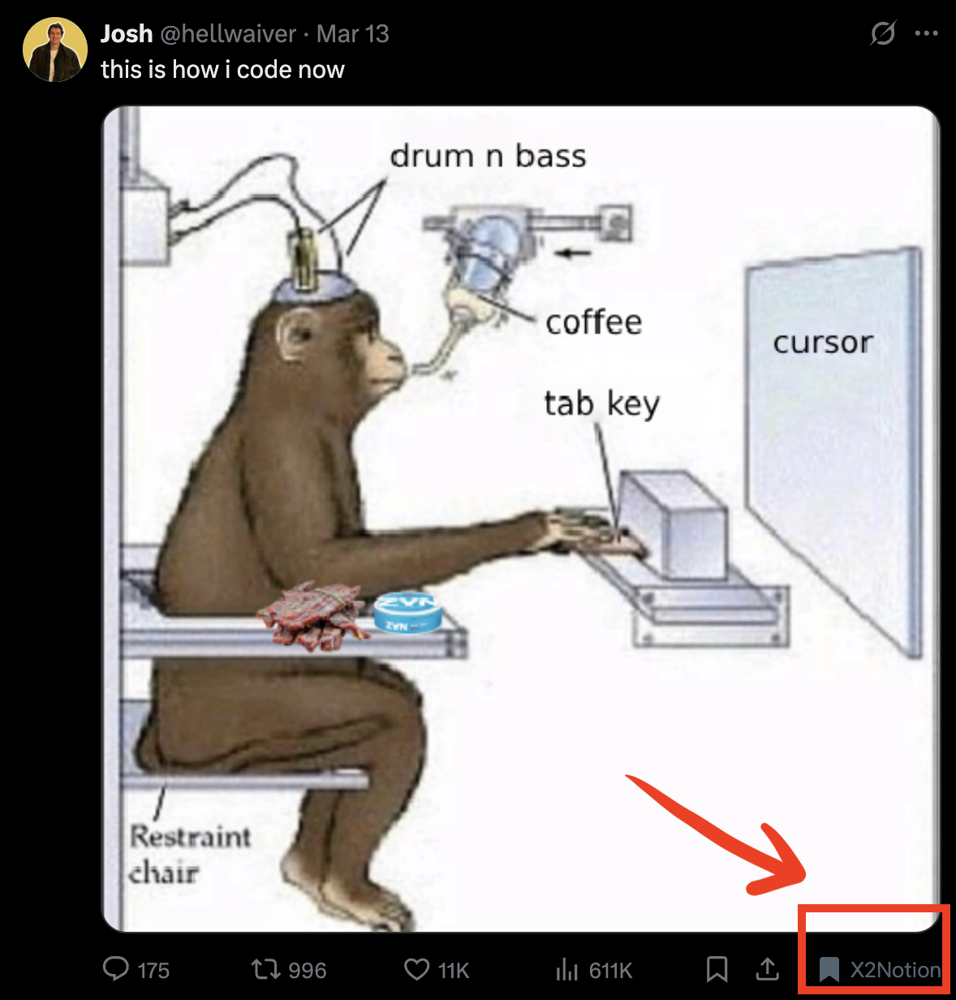

[中文](./README_cn.md) | [英文](./README.md)

# X2Notion Chrome插件

X2NotionChrome浏览器插件，将Twitter/X的post保存在Notion的Database里

## 安装方法

### 开发模式安装

1. 下载或克隆此仓库到本地
2. 打开Chrome浏览器，进入扩展程序页面 (chrome://extensions/)
3. 开启"开发者模式"
4. 点击"加载已解压的扩展程序"
5. 选择此项目的文件夹

## 使用方法

1. 在Notion中创建一个新的集成
   - 访问 [Notion集成页面](https://www.notion.so/my-integrations)
   - 创建一个新的集成并获取API密钥

2. 在Notion中创建一个新的数据库，包含以下属性：
   - Name (标题, 默认)
   - URL (URL)
   - Type (Text)
   - Sender (Text)
   - PostDate (Date)
   - SaveDate (Date)

3. 将数据库与您的集成共享
   - 在Notion中打开数据库
   - 点击右上角的"共享"按钮
   - 添加您的集成

4. 配置插件
   - 点击Chrome工具栏中的X2Notion图标
   - 点击"设置"按钮
   - 输入您的Notion API密钥和数据库ID
   - 点击"保存设置"

5. 使用插件
   - 浏览任意网页
   - 点击Chrome工具栏中的X2Notion图标
   - 选择"保存整个页面"或"保存选中内容"

